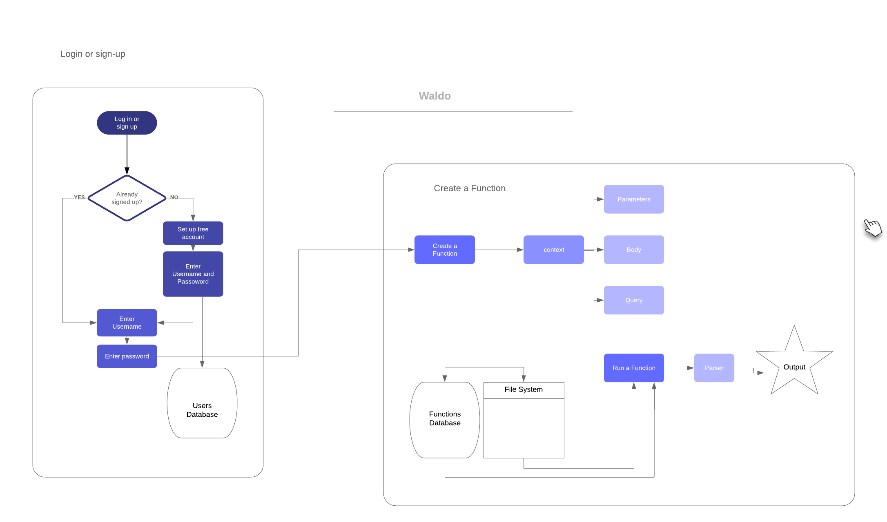
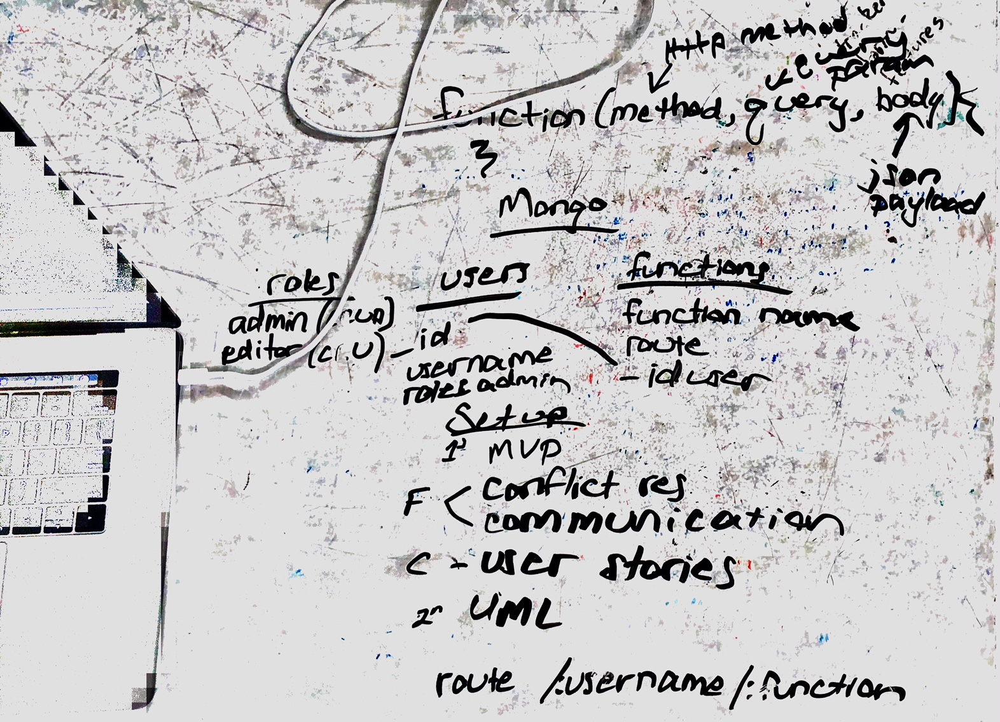
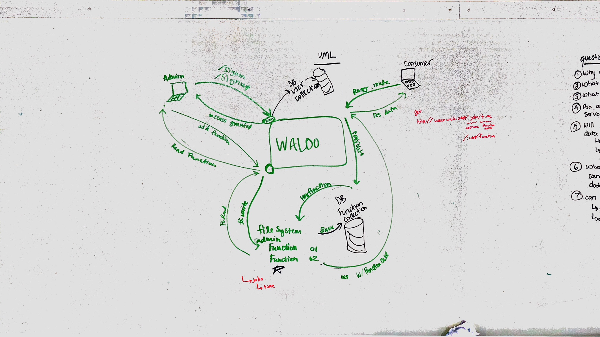
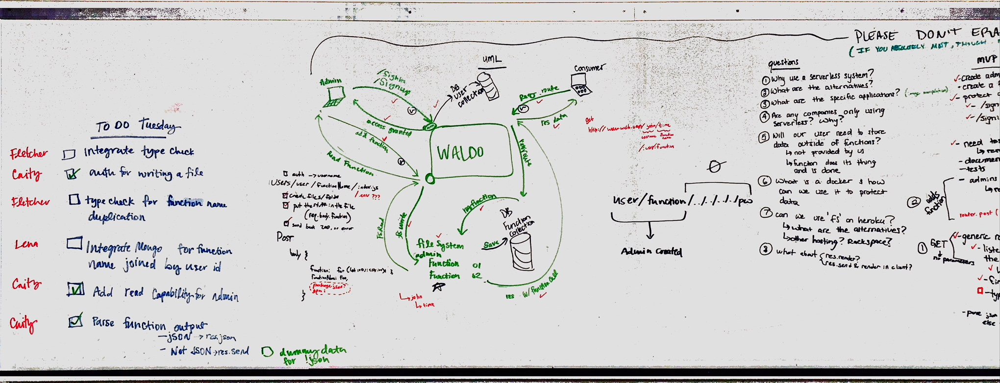

 LAB

## WALDO

### Author: Lena Eivy, Caity Heath, Fletcher LaRue

### Links and Resources
[](https://travis-ci.com/applena/where-is-the-server.svg)
* [repo](https://github.com/applena/where-is-the-server)
* [travis](https://travis-ci.com/applena/where-is-the-server.svg?branch=master)
* [back-end](https://waldo-server.herokuapp.com/) (when applicable)

#### Documentation
* [swagger](/swagger)
* [jsdoc](/docs) 

---
### Project Description 
Wouldn't it be nice to be able to host a site without needing to build, maintain, or house a server? This project provides users with a server so that they can focus on the experience of their clients. Waldo is known in the industry as a cloud or serverless system. Our team of three built this technology as a way of learning about serverless systems. After all the best way to learn about something is to build it! 

---
## Running Waldo
WALDO was written for two tpes of users. 

### The Admin User
The first type is the admin user who will make an account on our app, and use our server to connect their functions and their routes. The Admin User should go through the following steps to create an account.

#### 1. Authentication
The first step is to sign-up  by making an account with waldo. To do so enter the following command.<br><br>
`http post :3000/signup username='username' password='password'` Replace the quoted 'username' and 'password' with your own username and password without quotes. 

This will return you a token which you can use later to signin.

#### 2. Authorization
Once you've created an account you are assigned permissions to visit pages that consumers are not. You will have the ability to deploy functions to our database. You may also read your deployed functions. To sign in,  you have two choices:
* sign in with your username and password:
`http post :3000/signin -a 'username':'password'`

-or

* sign in with your bearer token that you got when you signed up. 
`http POST :3000/signin authorization:bearer\ 'token'`

#### 3. Deploy a function
You must be signed in to deploy a function. 

* go to `/createFunction` route
- you will need to put your authorization token in the header to verify your identity
- add the following information to the body of your request:
  - `functionName` = `'function name'`
  - `functionCode` = `'your function'`
* an example httpie request will look like the following:
```
http :3000/createFunction authorization:bearer\ 'token' functionName='functionTest' functionCode="module.exports=()=>{return 'hello world';};"
```
* Functions can send in 'context' as a parameter that holds the following information: `{body:request.body, env:process.env, param:request.params, query:request.query}`
* NOTE: you will need to remove the white space from your function if using httpie and you must have the double quotes around your code.

Congratulations! Your funciton is now hooked up and will be run by your consumers when they go to the following path: `/'username'/'functionName'`

### The Consumer
Our app is also built to support a consumer user. This is a user who will be visiting the paths that our admin users create

#### Using the App as a Consumer
Our app is designed to be easily used by any consumer. No security is needed to visit any path that has been estabilished by the admin user. Simply navigate to /'username'/'functionName' to access the function that you want to access. You will recieve the output of the function in your terminal.


### Modules
#### `auth/modules/handleSignin.js`
##### Exported Values and Methods
###### `handleSignin(req, res, next) -> middleware`
Middleware function that returns an auth token

#### `auth/modules/handleSignup.js`
##### Exported Values and Methods
###### `handleSignup(req, res, next) -> middleware`
Creates a new User using the User model, saves that user to the database, and then generates an authentication token for that user

#### `middleware/notFound.js`
##### Exported Values and Methods
###### `(req, res, next) -> res.status(404)`
Catches route errors and displays 404 status message with error information.

#### `middleware/error.js`
##### Exported Values and Methods
###### `(req, res, next) -> res.status(500)`
Catches errors and displays a 500 status with the error.

#### `auth/models/function-model.js`
##### Exported Values and Methods
###### `(functionObj) -> an object that contains the function name and the username`
A mongoose schema of a function which includes functionName and username.

#### `auth/models/users-model.js`
##### Exported Values and Methods
###### `(req.body)`
A mongoose schema of a user and virtually links that users functions. This model also hashes the users password and generates and authenticates the user token

#### `auth/auth-middleware.js`
##### Exported Values and Methods
###### `auth middleware`
authenticates that a user can access the path they are trying to access

#### `auth/router.js`
##### Exported Values and Methods
###### `auth router`
handles the routes for signin and signup

#### `auth/saveFunction.js`
##### Exported Values and Methods
###### `(functionName) => the name of the function to be saved`
creates a new instance of a function in the DB, saves it and returns it

#### `modules/fileExists.js`
##### Exported Values and Methods
###### `(path) => the file path`
returns a boolean if a filepath exists

#### `modules/functionExists.js`
##### Exported Values and Methods
###### `(user, functionName) => the name of the user and the name of the function`
returns a boolean if a functionName already exists for a given user

#### `modules/handleCreate.js`
##### Exported Values and Methods
###### `(path, data) => the filepath and the function data`
writes a the new function to a file or overwrites a function that already exists

#### `modules/handleCreateFunction.js`
##### Exported Values and Methods
###### `(req, res, next) => the request, response and next object`
saves a new function name and username to the database and handles the creation proccess for that function

#### `modules/handleGetUserfunctions.js`
##### Exported Values and Methods
###### `(req, res, next) => the request, response and next object`
Asynchronous. Performs fs.readdir on the user's directory. If no directory exists, next() is called with 'Resource not found'

#### `modules/parseJson.js`
##### Exported Values and Methods
###### `(obj) => the response object from a function`
Determines whether the return from the stored function is a JSON object or otherwise. If it is a JSON object it returns true, else it returns false

#### `modules/valid_path.js`
##### Exported Values and Methods
###### `(str) => file path string`
Determines whether a string is valid for file paths


### Setup
#### `.env` requirements
* `PORT` - port 3000 or connect to heroku
* `MONGODB_URI` - URL to the running mongo instance/db/ `MONGODB_URI=mongodb://localhost:27017/waldo`

#### Running the app
* `npm start`
* Endpoint: `/signup`
  * Returns a token after successful signup providing a username and passwords
* Endpoint: `/signin`
  * Can either use Basic signup with a username and password or use a bearer token
  * Returns a token after successfully signing in
* Endpoint: `/createFunction`
  * Once you are signed in, you can create a function and an endpoint. Your endpoint will be your `/${username}/${functionName}`
  * To create a function, navigate to /createFunction and send your auth token in the header. Send functionName and functionCode in the body as key value pairs. Functions can send in 'context' as a parameter that holds the following information: `{body:request.body, env:process.env, param:request.params, query:request.query}`
* Endpoint: `/${username}/${functionName}`
  * endpoints that are accessed by the consumer. They will do what the associated function tells them to do and produce what it tells them to produce.

# Tests

## Create User

```bash
# Create an admin user who can add functions and routes

USER_NAME=bob
CAPABILITIES='["c", "r", "u", "d"]'

USER_TOKEN=$(http POST :3000/signup username=$USER_NAME password=yo role=user)

```

## Add a funciton

```bash

#first sign up a new user
USER_NAME=catherine
CAPABILITIES='["c", "r", "u", "d"]'
FUNCTIONNAME=testFunction
FUNCTIONCODE="module.exports=()=>{return 2+2;};"

USER_TOKEN=$(http POST :3000/signup username=$USER_NAME password=yo role=user)

#create a new function and route
ROUTE=$(http POST :3000/createFunction authorization:bearer\ $USER_TOKEN functionName=$FUNCTIONNAME functionCode=$FUNCTIONCODE)

```

## Run a function on a route

```bash

RUN_FUNCTION=$(http :3000/$USER_NAME/$FUNCTIONNAME)

echo $RUN_FUNCTION
#will produce 'hello world'
```

## RUNNING THE UNIT TESTS
* `npm test`
* asserting that all routes are reachable and deliver what we think they should
* asserting that the signup route signs up a user
* asserting that the signin route sings in a user
* asserting that the create function route does indeed create a function that excutes when a comsumer hits the path `/${username}/${functionName}`
* asserting that all user created routes run user created functions when hit


## How do I setup my .env? How do I set that up remotely?
* To set up your .env, you will need to specify the following variables:
```
MONGODB_URI=mongodb://localhost:27017/users
PORT=3000
SECRET=changeit
TOKEN_LIFETIME=900000
```

## What routes are supported?
* user routes:
  - /signup
  - /signin
  - /createFunction
  - /${username}/${functionName}


## How do I call them and what data do they expect?
* To call the routes, go to the heroku site or your local host and add the route to the end of the URL

## expected data
  - /signup => a token
  - /signin => a token
  - /createFunction => status 200
  - /${username}/${functionName} => whatever the user function specifies

## What format does data come back?
* Data is returned in the form that the admin user specifes in their function

##UML

<br>





